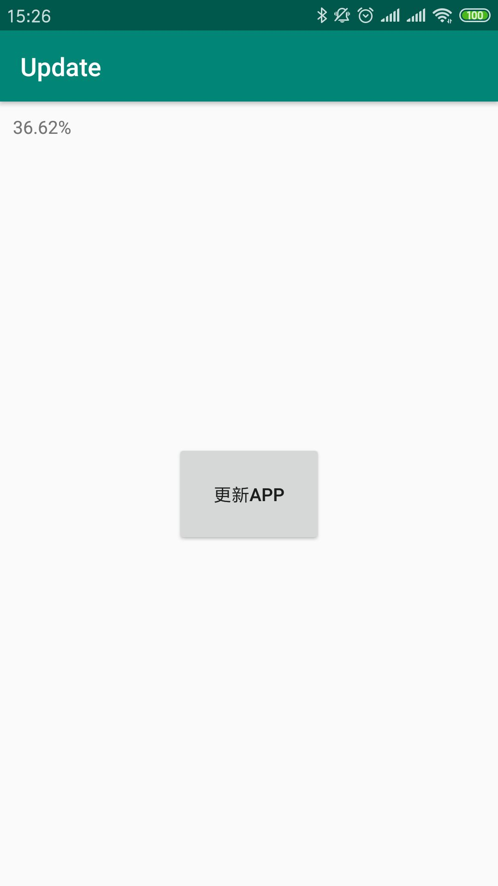
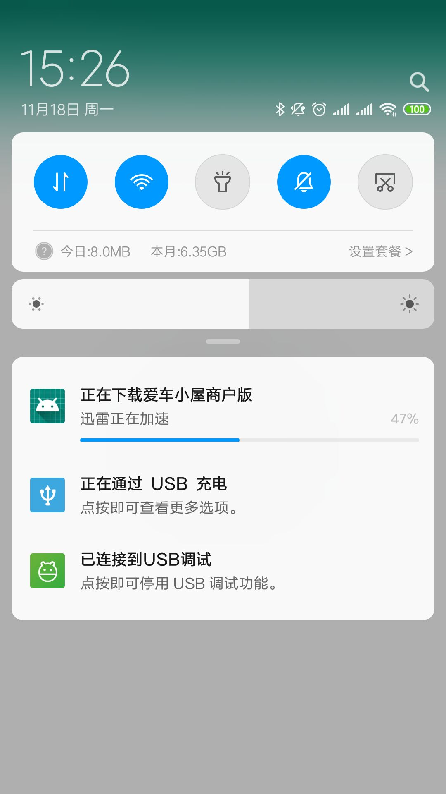

# UpdateUtils
更新APP，有进度回调，适用于APP的更新和任何自定义更新UI的开发。
用的是Android原生系统的下载器，支持通知栏显示，兼容性较好。

### 引入

```
allprojects {
		repositories {
			...
			maven { url 'https://jitpack.io' }
		}
	}


implementation 'com.github.wenkency:update:1.8.0'
implementation 'com.github.wenkency:filepaths:1.2.0'

```

### 使用方式(记得添加内存卡权限)
```
        private void down() {
            String apkUrl = "https://your apk down url";
            AppUpdateBean bean = new AppUpdateBean(apkUrl, "apkName.apk", 123);
            mDownloadUtils = new UpdateUtils(MainActivity.this, bean);
            mDownloadUtils.setOnUpdateListener(new OnUpdateListener() {
                @Override
                public void onFailed(String msg) {
                    Toast.makeText(getApplicationContext(), msg, Toast.LENGTH_SHORT).show();
                }

                @Override
                public void onSucceed(File apkFile) {
                    // 安装
                    AppFileProvider.installApk(MainActivity.this, apkFile);
                    Toast.makeText(getApplicationContext(), "下载成功", Toast.LENGTH_SHORT).show();
                }

                @Override
                public void onProgress(int total, int current, float progress) {
                    mTextView.setText(String.format("%.2f", progress) + "%");
                }
            });
            mDownloadUtils.downloadAPK();
        }

        @Override
        protected void onDestroy() {
            if (mDownloadUtils != null) {
                mDownloadUtils.stop();
            }
            super.onDestroy();

        }

```

### 运行结果


